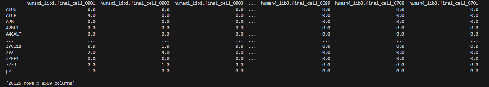
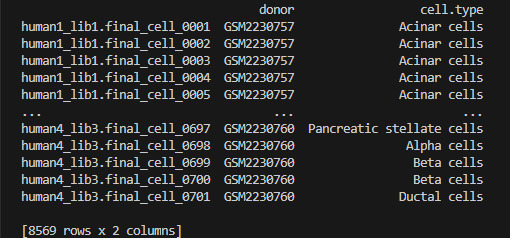
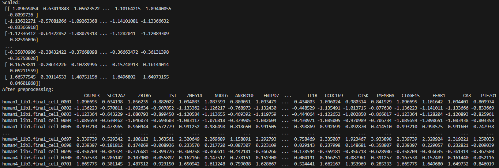
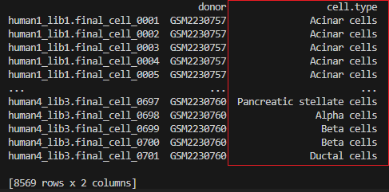
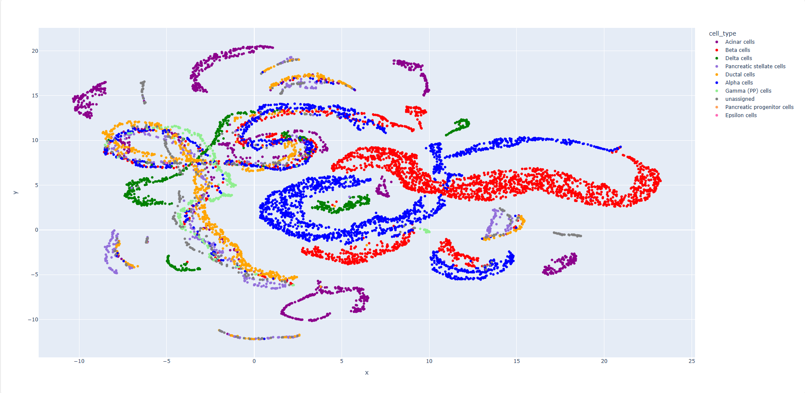

# sc-pred

## Description
Python package for cell identity recognition at individual cell level from single-cell RNA-seq data.<br/><br/>
Cell types for unknown cells are predicted, through a statistical approach, using raw gene expresssion <br/>
data among a list of cells, and a gene marker dataset consisting of a list of genes found in known cell types/gene sets.<br/><br/>
sc-pred is based off of the
- R software: https://github.com/RausellLab/CelliD
- CelliD statistical method presented in the article: <a href="https://www.nature.com/articles/s41587-021-00896-6.epdf?sharing_token=cb8TdGrz0o3PXjXn_wZGCdRgN0jAjWel9jnR3ZoTv0Oa3WzvJLtg4J6wv_eRGblv7pCmV-VB-3abW6uWDvAeOER7rbNPidd1IsRjFITIK8SJ_d0RrfACjtlZFkN4l3DDZLXWnaDW2XZDF1uZ-2DWCHQNkva9vqKjz708F5zU2FU%3D">Gene signature extraction and cell identity recognition at the single-cell level with Cell-ID, Nature Biotechnology 2021</a>


## Table of Contents
- [Installation](#installation)


- [Usage](#usage)

<ul>
<ul>
<li><a href="#step1">Step 1 - Store raw gene count data in a pandas data frame.</a></li>
<li><a href="#optional_Restrict">Optional Step - Restricting the analysis to protein-coding genes</a></li>
<li><a href="#optional_Remove_genes">Optional Step - Remove genes that are expressed in less than n cells.</a></li>
<li><a href="#optional_meta">Optional Step - Store meta data</a></li>
<li><a href="#step2">Step 2 - Preprocess the raw gene count data through natural log transformation, normalization, and scaling.</a></li>
<li><a href="#optional_diff">Optional step - Keep the most differentially expressed genes</a></li>
<li><a href="#step3">Step 3 - Multiple Correspondence Analysis (MCA) dimensionality reduction method</a></li>
<li><a href="#optional_plot_coordinates">Optional step - Plot cell and gene coordinates</a></li>
<li><a href="#step4">Step 4 - Find the euclidean distance between the coordinates of genes and cells among the j dimensions.</a></li>
<li><a href="#step5">Step 5 - Acquire gene marker database with known cell types and their associated gene signatures.</a></li>
<li><a href="#step6">Step 6 - Use hypergeometric testing to perform per-cell signature enrichment analysis against reference gene sets.</a></li>
<li><a href="#optional_validate">Optional Step - Validate and see how many cells were incorrectly predicted using meta data of known cell types for each cell.</a></li>
<li><a href="#optional_umap">Optional step - (UMAP/TSNE) Plot cells with their cell type predictions and actual cell types.</a></li>
</ul>
</ul>

- [Results](#results)
- [Hardware](#hardware)
- [Author](#author)
- [License](#license)

## Installation
- Make sure you have the latest version of python installed: https://www.python.org/downloads.
- Download the requirements.txt file from https://github.com/RockLee117/sc-pred. Then, in the same directory as the .txt file, run the following command to download the required dependencies:
```
pip install -r requirements.txt
```

- Install the package:
```
pip install sc-pred
```

## Usage
Any data used in the examples can be found in the zipped data folder within the repository.

<div id="step1">

### Step 1 - Store raw gene count data in a pandas data frame. 
</div>
Genes are rows and columns are cells. Row and column names MUST be included. Values will represent gene expression of gene X in cell Y. Here, the Baron pancreas single-cell RNA-seq data set provided in <a href="https://www.sciencedirect.com/science/article/pii/S2405471216302666?via%3Dihub">Baron et al. 2016</a> is being utilized.<br>
<br/>

```
import pandas as pd
import numpy as np
from Ramin123455.mca import RunMCA
from Ramin123455.hyper import RunCellHGT
from Ramin123455.visual import Visualize_Coordinates
from Ramin123455.preprocessData import preprocess
from Ramin123455.diff_exp import top_diff_exp_genes
from Ramin123455.dist import GetDistances
from Ramin123455.filter_genes import filter_genes
from Ramin123455.visual import Visualize_Distance_GeneExp

# raw gene count data
df = pd.read_csv('BaronMatrixFirstHalf.csv')
df.index = df.iloc[:, 0].tolist() # row names
df = df.iloc[:, 1:] # excluding the column of indexes from the .csv that were added after reading from .csv
df = df.astype('float64')

df2 = pd.read_csv('BaronMatrixLastHalf.csv')
df2.index = df2.iloc[:, 0].tolist() # row names
df2 = df2.iloc[:, 1:] # excluding the column of indexes from the .csv that were added after reading from .csv
df2 = df2.astype('float64')

baron = pd.concat([df,df2])
```
This dataset was stored in an R specific object (within a .rds file), so the data was read from RStudio then written to .csv files to be read from python. The raw gene count matrix was too large to be written to a single .csv file in one write so had to do 2 writes along with 2 reads in python and concatenate the data read to one pandas data frame. NOTE, some of the lines of code above are specific to this situation.

```
print(baron)
```

gene count data frame: <br/>
 <br/>

<div id="optional_Restrict">

### Optional Step - Restricting the analysis to protein-coding genes
</div>
Using only genes found in the HgProteinCodingGenes list obtained from BioMart Ensembl release 100, version April 2020 (GrCH38.p13 for human, and GRCm38.p6 for mouse). Here the HgProteinCodingGenes was originally read from RStudio, after loading the R CelliD library, using: data("HgProteinCodingGenes"). Then, written to a .csv file to be read from python.

```
### Optional Step - Restricting genes to protein-coding genes
HgProteinCodingGenes = pd.read_csv('HgProteinCodingGenes.csv')
baron = baron.loc[list(set(HgProteinCodingGenes['x'].tolist()) & set(baron.index))] # inner join of gene lists
```
```
print(baron)
```
gene count data frame: <br/>
 <br/>

<div id="optional_Remove_genes">

### Optional Step - Remove genes that are expressed in less than n cells.
</div>

```
genes = filter_genes(df=baron, n=5) # input dataframe must be genes as rows and cells as columns
baron = baron.loc[genes]
```

<div id="optional_meta">

### Optional Step - Store meta data
</div>
You can store meta data for the cells in a pandas data frame which can be used to group the cells in the following step for gene filtering. In the meta data frame, rows are cells and columns are different meta data. The meta data was originally stored in an R specific object (within a .rds file), so the data was read from RStudio then written to .csv files to be read from python.

```
# meta data (optional)
baron_meta = pd.read_csv('BaronMeta.csv')
baron_meta.index = baron_meta.iloc[:, 0].tolist() # row names
baron_meta = baron_meta.iloc[:, 1:]  # excluding the column of indexes from the .csv that were added after reading from .csv
```
meta data frame: <br/>
<br/>


<div id="step2">

### Step 2 (CRUCIAL STEP for determining accuracy of cell type prediction)- Preprocess the raw gene count data through natural log transformation, normalization, and scaling.
</div>
&nbsp;&nbsp;&nbsp;&nbsp; Using the preprocess function which utilizes <a href="https://numpy.org/doc/stable/reference/generated/numpy.log.html">numpy's natural log function</a> along with <a href="https://scikit-learn.org/stable/modules/preprocessing.html">sklearn's normalizing and scaling functions</a>, optionally choose which preprocessing steps to be done and the order of them. Can either be (1) normalizing, natural log transformation, then scaling, OR (2) natural log transformation, normalizing, then scaling. From there, filter which of the steps you want to perform by specifying False for the preprocess() function attributes. Can optionally add 1 as well for the (2) order after performing log transformation (may improve results). Observe preprocessData.py for better understanding.

&nbsp;&nbsp;&nbsp;&nbsp; "Taking the log of the data can restore symmetry to the data."(<a href="https://www.sciencedirect.com/topics/computer-science/log-transformation">How precise are our estimates? Confidence intervals
Jeff Sauro, James R. Lewis, in Quantifying the User Experience (Second Edition), 2016</a>). <a href="https://www.analyticsvidhya.com/blog/2020/04/feature-scaling-machine-learning-normalization-standardization/#What_Is_Normalization?">Normalizing</a> results in values between 0 and 1, and scaling helps "ensure that all features contribute equally to the model and avoid the domination of features with larger values." (<a href="https://www.analyticsvidhya.com/blog/2020/04/feature-scaling-machine-learning-normalization-standardization/#:~:text=Feature%20scaling%20is%20a%20data,of%20features%20with%20larger%20values.">Feature Engineering: Scaling, Normalization, and Standardization, Aniruddha Bhandari, October 27th, 2023</a>).
<br>&nbsp;&nbsp;&nbsp;&nbsp;"There is no guarantee that the log-transformation will reduce skewness and make the data a better approximation of the normal distribution" and "log transformation can often increase – not reduce – the variability of data whether or not there are outliers." (<a href="https://www.ncbi.nlm.nih.gov/pmc/articles/PMC4120293/">Feng C, Wang H, Lu N, Chen T, He H, Lu Y, Tu XM. Log-transformation and its implications for data analysis. Shanghai Arch Psychiatry. 2014</a>). Therefore, **best to try different combinations of preprocessing steps to see what works best for your data.** <a href="#results">Here are the results from different combinations of preprocessing of the Baron single cell pancreas data.</a>

&nbsp;&nbsp;&nbsp;&nbsp; If performing log transformation first, you can avoid problems with zeros turning into -infinity values by adding 1 to the gene count data frame (this problem occurs if taking the log of 0 as this is undefined). Experiment adding 1 to the input gene count data if doing normalization first as well. 
<br>&nbsp;&nbsp;&nbsp;&nbsp;The gene count data frame is transposed since the preprocess function expects the input data frame to consist of cells as rows (samples) and genes as columns (features), allowing for the values for genes to be normalized across every cell.
```
# The preprocessing function expects cells to be rows and columns to be genes so transpose
baron = baron.transpose()
baron = baron + 1
assay_df = preprocess(baron, order=1, log=False)
```
Above example specifies to preprocess in the order of (1) norm, log, then scale and to not perform log transformation (log=False) so data is normalized then scaled.

Output: <br/>
 <br/>
 <br/>

<div id="optional_diff">

### Optional step - Keep the most differentially expressed genes
</div>

**This may improve, worsen, or not affect the accuracy of the predictions.**<br>
This step requires meta data for the cells to be grouped by. In this example, the cells are grouped by their known cell types (cell.type):<br>
<br/>
The most differentially expressed genes per meta data grouping of cells are kept using <a href="https://scanpy.readthedocs.io/en/stable/generated/scanpy.tl.rank_genes_groups.html">scanpy's rank_genes_groups()</a> function. **All of the genes are given a score per cell group. Only the genes that are above the score_threshold are kept (default is 0).** You must pass the following to the top_diff_exp_genes() function: the log transformed raw gene count data, data frame containing meta data, the list of all possible values in the meta data, the column name of the meta data being used in the meta data frame, and the score threshold.
```
# values in the meta data that the cells will be grouped by
cell_types = ['Acinar cells',
            'Beta cells',      
            'Delta cells',
            'Pancreatic stellate cells',
            'Ductal cells',
            'Alpha cells',
            'Epsilon cells',
            'Gamma (PP) cells',
            'Endothelial cells',
            'Macrophages',
            'Peri-islet Schwann cells',
            'Mast cells',
            'T cells']

# MUST pass log transformed (RAW gene count data + 1) -> +1 was done earlier to avoid taking log of 0 which is undefined
most_diff_exp_genes_set = top_diff_exp_genes(gene_count_df=np.log(baron), meta_data_df=baron_meta, 
                                             meta_list=cell_types, meta_col_name='cell.type', score_threshold=0)
print("Before gene filtering: ", assay_df.shape)
# filter genes
assay_df = assay_df.loc[:, most_diff_exp_genes_set]
print("After gene filtering: ", assay_df.shape)
print(assay_df)
```
<br/>
... will output scores for all cell groups

<br/>

<div id="step3">

### Step 3 - Multiple Correspondence Analysis (MCA) dimensionality reduction method
</div>

Generate cell and gene coordinates in a j dimensional space (j=50 dimensions by default). assay_df is the preprocessed raw gene count data frame with cells as rows and genes as columns. NOTE: upon consecutive calls of generating coorddinates, the signs of the coordinate values may differ meaning one time the value will be positive and another time will be negative. BUT, the distance between gene X and cell Y is still always the SAME. Thus, does not affect the next step in cell identification being to find the distance between genes and cells in a j dimensional space.
```
# mca_result is an object containing:
    # cellCoordinates: pandas data frame where rows are cells and columns are j (default value for j is 50) different dimensions
    # geneCoordinates: pandas data frame where rows are genes and columns are j (default value for j is 50) different dimensions
    # X: fuzzy-coded indicator matrix
mca_result = RunMCA(assay_df, j=20) # j specifies number of dimensions for cell and gene coordinates (default, j=50)
```

<div id="optional_plot_coordinates">

### Optional step - Plot cell and gene coordinates
</div>
Out of the j dimensions, they are condensed into 3 dimensions using umap-learn's UMAP method and plotly's plotting functions for visualization. Adjust the min_dist and n_neighbors parameters to change how the <a href="https://pair-code.github.io/understanding-umap/">UMAP</a> is visualized:<br>
&nbsp;&nbsp;&nbsp;&nbsp;- n_neighbors: should be a value between 2 and 100. Low values will push UMAP to focus more on local structure by constraining the number of neighboring 
        points considered when analyzing the data in high dimensions, while high values will push UMAP towards representing the big-picture structure while losing fine detail. <br>
&nbsp;&nbsp;&nbsp;&nbsp;- min_dist: should be a value between 0.0 and 0.99. Controls how tightly UMAP clumps points together, with low values leading to more tightly packed embeddings. Larger values of min_dist will make UMAP pack points together more loosely, focusing instead on the preservation of the broad topological structure.

For the coordinate representations, we want a close local view with points spread out and not tightly packed so, here lower n_neighbors and higher min_dist values are being used. Default values are n_neighbors=15 and min_dist=0.1. The plot is opened in a web browser and the .html is downloaded locally.
```
Visualize_Coordinates(cellCoordinates=mca_result.cellCoordinates, geneCoordinates=mca_result.geneCoordinates, n_neighbors=10, min_dist=0.5)
```


<div id="step4">

### Step 4 - Find the euclidean distance between the coordinates of genes and cells among the j dimensions.
</div>

DT will be a pandas data frame, containing euclidean distances between genes and cells (rows are genes, cells are columns).
```
DT = GetDistances(cellCoordinates=mca_result.cellCoordinates, geneCoordinates=mca_result.geneCoordinates)
```
Also, can optionally generate gene coordinates through barycentric relationship between gene and cell coordinates, then find euclidean distance between them.
```
DT = GetDistances(cellCoordinates=mca_result.cellCoordinates, geneCoordinates=mca_result.geneCoordinates, X=mca_result.X, barycentric=True)
```

<div id="step5">

### Step 5 - Acquire gene marker database with known cell types and their associated gene signatures.
</div>

Create a pandas Series where every index represents a gene set/cell type (indexes should be labelled with the cell type/gene set name). The value at every index is a list of genes that are in the gene set/cell type. **The unknown cells will be predicted to be associated with one of these gene sets or none (labelled as "unassigned").** The <a href="https://panglaodb.se/">Panglao database</a> is used to acquire pancreatic cell-type gene signatures.
```
panglao = pd.read_csv('https://panglaodb.se/markers/PanglaoDB_markers_27_Mar_2020.tsv.gz',sep='\t')
# restricting the analysis to pancreas specific gene signatues
panglao_pancreas = panglao[panglao['organ'] == "Pancreas"]
# restricting to human specific genes
panglao_pancreas = panglao_pancreas[panglao_pancreas['species'].str.contains("Hs") ]
# get gene marker dataset in format where every index is the cell type then the value in every index is a list of the official gene symbols (genes) for that cell type
# panglao_pancreas becomes a pandas Series
panglao_pancreas = panglao_pancreas[['cell type', 'official gene symbol']]
panglao_pancreas = panglao_pancreas.groupby('cell type')['official gene symbol'].apply(list)
print("Gene marker dataset:\n", panglao_pancreas)
```


<div id="step6">

### Step 6 - Use hypergeometric testing to perform per-cell signature enrichment analysis against reference gene sets.
</div>

Predict the cell type/gene set for each unknown cell using hypergeometric testing. First, the gene signature for every cell n is acquired 
by keeping the n_genes (n_genes=200 by default) smallest euclidean distance values per cell in the distance data frame DT. Then, W_1,W_2, ... W_omega is determined
which are the genes in each gene set W_i that are in the genes list P, the genes in the gene expression matrix after any gene filtering 
steps (W_i is a subset of P). The gene sets W_i that have < minSize (minSize=10 by default) number of genes are ignored. w is acquired being the intersection of 
the genes between each cell's gene signature and W_i. Then, <a href="https://docs.scipy.org/doc/scipy/reference/generated/scipy.stats.hypergeom.html">hypergeometric 
distribution</a> is performed with a probability mass function using variables described: <br>

<ul>    
    <li>k = w_i,n (number of genes in intersection of W_i and cell n's gene signature)</li>
    <li>M = P (number of genes in gene expression matrix after any gene filtering steps done before hyper geo testing)</li>
    <li>n = W_i (number of genes in gene set/cell type after subsetting it from P)</li>
    <li>N = n_genes (number of genes in cell's gene signature)</li>
</ul>
Probability values (p-values) between each cell and gene set is acquired. Next,  
p-values are optionally adjusted with Benjamini Hochberg correction on every cell among the gene sets and/or -log base 10 transform p-values ***(log transform only 
scales the values and has no affect on the prediction results)***. Finally, cell's gene sets are predictied using rules described: <br><br>
A cell is considered as ENRICHED in those gene sets for which 
<ul>
<li>case 1: p-value < 0.01 : (neither BH correction nor log transform) or (just BH correction on p-values)
<li>case 2: p-value > 2 : (only log transform the probability values) or (BH correction then log transform p-values)</li>
</ul>
When a disjointed classification is required (for a cell, there are multiple values/gene sets that are in the enriched range):
<ul>
<li>case 1: a cell will be assigned to the gene set with the LOWEST significant p-value. </li>
<li>case 2: a cell will be assigned to the gene set with the LARGEST significant p-value. </li>
</ul>
***If no significant hits are found (cell is not enriched in any of the gene sets), a cell will remain UNASSIGNED.***<br><br>

Pass the pandas data frame of euclidean distances between each cell and gene to DT, the pandas series gene marker dataset to gene_sets, change values of n_genes 
and minSize as needed, and choose whether you want to adjust the p-values with BH correction (p_adjust=True) and/or upscale the p-values by performing -log_10 (log_trans=True).
RunCellHGT() returns a pandas Series where the indexes are the names of the unknown cells and values are the cell type/gene set predictions per cell.
```
HGT = RunCellHGT(DT=DT, gene_sets=panglao_pancreas, n_genes=200, minSize=10, p_adjust=False, log_trans=False) 
HGT.to_csv("cell_type_predictions_Baron.csv")
```

<div id="optional_validate">

### Optional Step - Validate and see how many cells were incorrectly predicted using meta data of known cell types for each cell.
</div>

```
correct_cell = pd.read_csv("Baron_ActualCellType.csv") # actual labelled cell type for the unknown cells
cell_pred = pd.read_csv("cell_type_predictions_Baron.csv") # predictions

count = 0
count_unassigned = 0
for i in range(0, correct_cell.shape[0]):
    if correct_cell.iloc[i, 1] != cell_pred.iloc[i, 1]:
        count +=1
        if cell_pred.iloc[i, 1] == 'unassigned' and correct_cell.iloc[i, 1] != 'unassigned':
            count_unassigned +=1
        print("Cell Name: ", cell_pred.iloc[i,0])
        print("Actual: ", correct_cell.iloc[i, 1])
        print("Incorrect Prediction: ", cell_pred.iloc[i, 1], "\n")
        
print("Count differ: ", count)
print("Count of incorrect \"unassigned\" predictions: ", count_unassigned) 
```

<div id="optional_umap">

### Optional step - Plot cells with their cell type predictions and actual cell types. 
</div>

Plot the UMAP or TSNE of the euclidean distances data frame where each point on the plot represents a cell. One UMAP will be labelled 
with the predicted cell type and another UMAP will be labelled with the actual cell type for each cell. Must pass the euclidean distance 
data frame where cells are rows and columns are genes (must transpose), a list of the cell type labels for each cell, a dictionary specifying a color for each cell type, 
and specify whether UMAP (umap=True) or TSNE (umap=False) plot will be performed. For the UMAP, you may adjust the n_neighbors and min_dist parameters as well 
(by default, n_neighbors=10 and min_dist=0.5).<br>
```
# Create dictionary where the keys are the name of the cell types and the value is a color associated with the plotly package
color_scale = {
        'Acinar cells': 'darkmagenta',
        'Beta cells': 'red',      
        'Delta cells': 'green',
        'Pancreatic stellate cells': 'mediumpurple',
        'Ductal cells': 'orange',
        'Alpha cells': '#0000FF',
        'Epsilon cells': 'hotpink',
        'Gamma (PP) cells': 'lightgreen',
        'Endothelial cells': 'pink',
        'Macrophages': 'yellow',
        'Peri-islet Schwann cells': 'khaki',
        'Mast cells': 'darkgoldenrod',
        'T cells': 'firebrick',
        'unassigned': 'grey'
} 
# UMAP labelled with predicted cell types
Visualize_Distance_GeneExp(df=DT.T, cell_types=HGT.to_list(), color_scale=color_scale, umap=True)
# UMAP labelled with actual cell types
actual_cell_types = pd.read_csv("Baron_ActualCellType.csv").iloc[:, 1].to_list() 
Visualize_Distance_GeneExp(df=DT.T, cell_types=actual_cell_types, color_scale=color_scale, umap=True)
```
Here we can see that all of the Endothelial cells and Macrophages were labelled as unassigned. It can be assumed that this is from the lack of the Endothelial and Macrophage cell type's gene signature being provided in the gene marker dataset. Grey points are the cells whose cell type was unassigned.<br>
Predicted cell types for each cell:<br>

Actual cell types for each cell: <br>


## Results
The following are the number of cells out of 8569 whose cell type was **incorrectly** predicted using the <a href="https://www.sciencedirect.com/science/article/pii/S2405471216302666?via%3Dihub">Baron single cell pancreas data</a> and the <a href="https://panglaodb.se/">Panglao gene marker database</a> with different approaches:
<ul>    
    <li>746</li>
    <ul>
        <li>Restricting genes to protein-coding genes</li>
        <li>Remove genes expressed in less than 5 cells</li>
        <li>preprocessing: +1, norm, scale</li>
        <li>MCA: j=20 dimensions</li>
        <li>Hypergeo: n_genes=200, minSize=10, p_adjust=False, log_trans=False</li>       
    </ul>
    <li>741</li>
    <ul>
        <li>Restricting genes to protein-coding genes</li>
        <li>Remove genes expressed in less than 5 cells</li>
        <li>preprocessing: +1, norm, scale</li>
        <li>MCA: j=20 dimensions</li>
        <li>Hypergeo: n_genes=400, minSize=10, p_adjust=False, log_trans=False</li>       
    </ul>
    <li>890</li>
    <ul>
        <li>Restricting genes to protein-coding genes</li>
        <li>Remove genes expressed in less than 5 cells</li>
        <li>preprocessing: +1, norm, log, scale</li>
        <li>MCA: j=50 dimensions</li>
        <li>Hypergeo: n_genes=200, minSize=10, p_adjust=True, log_trans=False</li>       
    </ul>
    <li>1842</li>
    <ul>
        <li>Restricting genes to protein-coding genes</li>
        <li>Remove genes expressed in less than 5 cells</li>
        <li>preprocessing: +1, log, norm, scale</li>
        <li>MCA: j=50 dimensions</li>
        <li>Hypergeo: n_genes=200, minSize=10, p_adjust=True, log_trans=False</li>       
    </ul>
</ul>


Results  of different preprocessing orders with the following parameters:<br>
<ul>
    <li>Restricting genes to protein-coding genes</li>
    <li>Remove genes expressed in less than 5 cells</li>
    <li>MCA: j=50 dimensions</li>
    <li>Hypergeo: n_genes=200, minSize=10, p_adjust=True, log_trans=False</li>       
</ul>
Preprocessing:<br>
<ul>
    <li>+1, norm, scale -> 826 out of 8569 cells (# INCORRECT cells)</li>
    <li>+1, norm, log, scale -> 890 out of 8569 cells</li>
    <li>+1, log, norm, scale -> 1842 out of 8569 cells</li>
    <li>+1, log, +1, norm, scale -> 944 out of 8569 cells</li>
    <li>norm, scale (no +1 before doing preprocessing) -> 2737 out of 8569 cells</li>
</ul>

# Hardware
Processor: AMD Ryzen 7 5800 8-Core Processor, 3.40 GHz<br>
RAM: 64.0 GB
OS: 64 Bit Windows, x64-based processor

## Author
- Ramin Mohammadi, rammoh5346@gmail.com

## License

This package is under the GNU General Public License v3.0